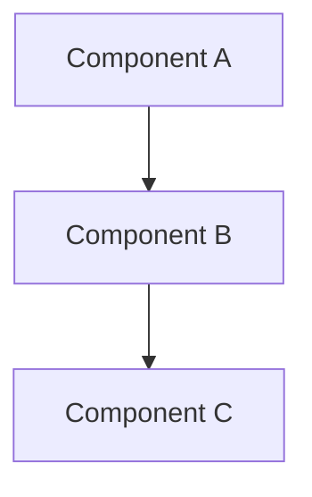
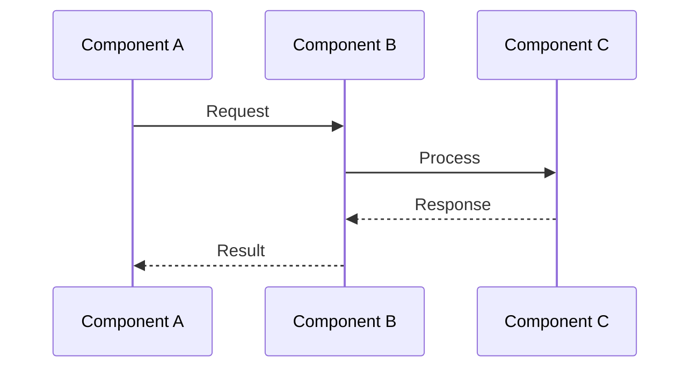
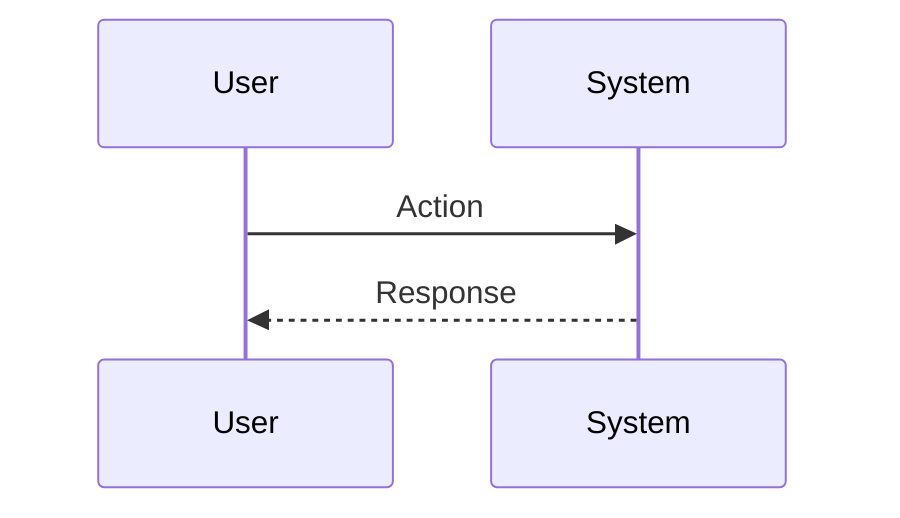

# 詳細設計書

## 概要

### 機能概要
[この設計書で扱う機能の概要を簡潔に記述]

### 要件定義書との紐付け
**対応する要件**:
- 要件1: [要件名] - [要件ID]
- 要件2: [要件名] - [要件ID]

**実現する機能**:
- [機能A]: [簡潔な説明]
- [機能B]: [簡潔な説明]

---

## アーキテクチャ

### 全体構成
[システムの全体アーキテクチャを図で表現 - Mermaid推奨]



### アーキテクチャパターン
[採用するアーキテクチャパターンを記述]

- [パターン名]: [説明]
- [パターン名]: [説明]

### モジュール設計原則

**単一責任の原則**:
- 各ファイルは1つの明確な責務を持つ
- 1ファイル = 1コンポーネント/1サービス/1ユーティリティ

**レイヤー分離**:
- **プレゼンテーション層**: UI コンポーネント、ルーティング
- **ビジネスロジック層**: サービスクラス、ドメインロジック
- **データアクセス層**: リポジトリ、データベース操作

**疎結合・高凝集**:
- 依存関係は一方向（上位層 → 下位層）
- インターフェースを用いた抽象化
- 循環参照の禁止

### 技術スタック

**言語・フレームワーク**:
- [言語]: [バージョン]
- [フレームワーク]: [バージョン]

**ライブラリ**:
- [ライブラリ名]: [用途]
- [ライブラリ名]: [用途]

**インフラ**:
- [データベース]: [バージョン]
- [キャッシュ]: [種類]
- [その他]: [詳細]

### 既存コードの再利用

**活用する既存コンポーネント**:
- **[コンポーネント名]**: [どう使うか]
- **[ユーティリティ名]**: [どう拡張するか]

**統合ポイント**:
- **[既存システム/API]**: [どう連携するか]
- **[データベース/ストレージ]**: [既存スキーマとの関係]

---

## プロジェクト構成

### ディレクトリ構造
```
project-root/
├── src/
│   ├── [ディレクトリ名]/
│   │   └── [ファイル名]
│   └── [ディレクトリ名]/
└── [その他]
```

### 各ファイルの責務

#### `[ファイルパス]`
- **役割**: [このファイルの責務を簡潔に説明]
- **実装内容**:
  - `[関数/クラス名]`: [説明]
  - `[関数/クラス名]`: [説明]

#### `[ファイルパス]`
- **役割**: [このファイルの責務を簡潔に説明]
- **実装内容**:
  - `[関数/クラス名]`: [説明]
  - `[関数/クラス名]`: [説明]

---

## コンポーネント設計

### Component 1: [コンポーネント名]

**責務**: [何をするコンポーネントか]

**インターフェース**:
```typescript
// 公開API/メソッドの定義
interface [InterfaceName] {
  [method]: ([params]) => [ReturnType]
}
```

**依存関係**:
- [依存するコンポーネント]: [用途]
- [依存するコンポーネント]: [用途]

**再利用**:
- [既存コンポーネントとの関係]

**実装例**:
```typescript
// 実装の擬似コードまたはサンプルコード
```

### Component 2: [コンポーネント名]

**責務**: [何をするコンポーネントか]

**インターフェース**:
```typescript
// 公開API/メソッドの定義
```

**依存関係**:
- [依存するコンポーネント]: [用途]

**再利用**:
- [既存コンポーネントとの関係]

---

## データモデル

### Model 1: [モデル名]
```typescript
interface [ModelName] {
  id: [type];           // [説明]
  [field]: [type];      // [説明]
  [field]: [type];      // [説明]
}
```

### Model 2: [モデル名]
```typescript
interface [ModelName] {
  id: [type];           // [説明]
  [field]: [type];      // [説明]
}
```

### Database Schema
[データベーススキーマ定義 - Prisma/TypeORM/SQL など]

```prisma
model [ModelName] {
  id        String   @id @default(uuid())
  [field]   [Type]
  createdAt DateTime @default(now())
  updatedAt DateTime @updatedAt

  @@index([field])
}
```

---

## データフロー

### [フロー名]
[データの流れを説明 - シーケンス図推奨]



### [フロー名]
[データの流れを説明]



---

## 非機能要件への対応

### パフォーマンス設計

**キャッシュ戦略**:
- [何をキャッシュするか]: [キャッシュ方法とTTL]
- [何をキャッシュするか]: [キャッシュ方法とTTL]

**最適化ポイント**:
- [最適化項目]: [具体的な対策]
- [最適化項目]: [具体的な対策]

**目標値**:
- [処理名]: [目標時間]
- [処理名]: [目標時間]

### セキュリティ設計

**認証・認可**:
- [認証方式]: [実装方法]
- [認可方式]: [実装方法]

**データ保護**:
- [保護対象]: [保護方法]
- [保護対象]: [保護方法]

**入力バリデーション**:
- [バリデーション項目]: [検証方法]
- [バリデーション項目]: [検証方法]

**監査ログ**:
- [記録対象]: [記録内容]
- [記録対象]: [記録内容]

### スケーラビリティ設計

**水平スケーリング**:
- [スケーリング戦略]

**データベース設計**:
- [スケーリング方法]

---

## エラーハンドリング設計

### エラーシナリオ1: [シナリオ名]

**シナリオ**: [エラーが発生する状況]

**対処方法**:
```typescript
// エラーハンドリングのコード例
try {
  // 処理
} catch (error) {
  // エラー処理
}
```

**ユーザー影響**: [ユーザーに表示されるメッセージや挙動]

### エラーシナリオ2: [シナリオ名]

**シナリオ**: [エラーが発生する状況]

**対処方法**:
```typescript
// エラーハンドリングのコード例
```

**ユーザー影響**: [ユーザーに表示されるメッセージや挙動]

---

## テスト戦略

### ユニットテスト

**テスト対象**:
- [コンポーネント名]: [テストする内容]
- [関数名]: [テストする内容]

**テストツール**: [Jest / Vitest / など]

**テストケース例**:
```typescript
describe('[テスト対象]', () => {
  it('[テストケース]', () => {
    // テストコード
  });
});
```

**カバレッジ目標**: [目標値]%以上

### 統合テスト

**テスト対象**:
- [統合ポイント]: [テストする内容]
- [API エンドポイント]: [テストする内容]

**テストツール**: [Supertest / など]

**テストケース例**:
```typescript
// 統合テストのコード例
```

**カバレッジ目標**: [主要なユースケースを網羅]

### E2Eテスト

**テスト対象**:
- [ユーザーフロー]: [テストする内容]
- [画面遷移]: [テストする内容]

**テストツール**: [Playwright / Cypress / など]

**テストケース例**:
```typescript
// E2Eテストのコード例
```

**実行環境**: [CI/CD / ローカル / など]

---

## 実装計画

### Phase 1: [フェーズ名]（[期間]）
- [タスク1]
- [タスク2]
- [タスク3]

**実装順序**:
1. [ステップ1]
2. [ステップ2]
3. [ステップ3]

### Phase 2: [フェーズ名]（[期間]）
- [タスク1]
- [タスク2]

### Phase 3: [フェーズ名]（[期間]）
- [タスク1]
- [タスク2]

---

## 技術的な意思決定

### 決定事項1: [意思決定のタイトル]

**選択**: [選択した技術・アプローチ]

**理由**:
- [理由1]
- [理由2]

**代替案**: [検討した他の選択肢]

**トレードオフ**:
- **メリット**: [選択のメリット]
- **デメリット**: [選択のデメリット]

### 決定事項2: [意思決定のタイトル]

**選択**: [選択した技術・アプローチ]

**理由**:
- [理由1]
- [理由2]

**代替案**: [検討した他の選択肢]

**トレードオフ**:
- **メリット**: [選択のメリット]
- **デメリット**: [選択のデメリット]

---

## 実装例

### 例1: [機能名]

```typescript
// 実装コードまたは擬似コード
// この機能の核となる実装パターンを示す
```

### 例2: [機能名]

```typescript
// 実装コードまたは擬似コード
```

---

## 改訂履歴

| バージョン | 日付 | 変更内容 | 変更者 |
|-----------|------|---------|--------|
| 1.0 | YYYY-MM-DD | 初版作成 | [氏名] |
| 1.1 | YYYY-MM-DD | [変更内容] | [氏名] |
